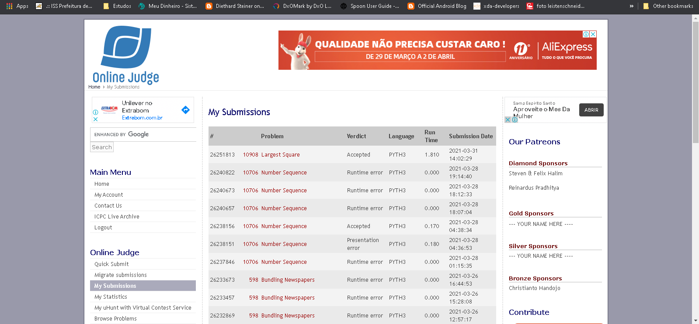

# Análise e Complexidade de Algoritmos

Rodrigo Seidel

PPComp — Campus Serra, Ifes

2020-03

## Breve explicação de como a técnica indicada foi utilizada
Após entrada dos dados necessários é feita uma verificação do tamanho do grid informado, dependendo da forma do grid, o maior tamanho do quadrado a ser pesquisado da coordenada sempre será 1.

Também me utilizei da característica do problema de que o lado do quadrado sempre será ímpar, descartando pesquisas de lados pares.

A partir daí foi necessário apenas fazer a pesquisa em torno da coordenada informada, sempre fazendo isso em camadas e sempre conferindo se todos os elementos da camada são iguais ao da coordenada buscada.

Caso na camada exista algum caracter diferente do buscado ou caso a coordenada caia em uma região fora do grid, a camada é rejeitada.

A técnica de pesquisa completa foi utilizada de forma que para confirmar o maior lado do quadrado possível a partir de uma coordenada, todas as outras coordenadas em torno dela são geradas e verificadas, sempre respeitando as camadas e o tamanho do grid.

Foi recebido "Accepted" no Online Judge, conforme imagem a seguir (primeiro item da lista):

## Análise da complexidade de tempo do programa desenvolvido

## Outras informações que o autor julgar apropriadas para o entendimento do trabalho realizado
