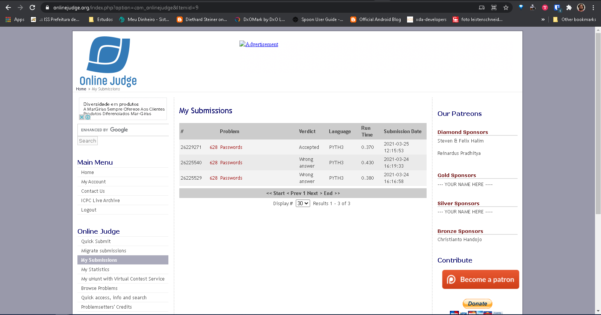

# Análise e Complexidade de Algoritmos

**Rodrigo Seidel**

**PPComp — Campus Serra, Ifes**

**2021-03**

## Breve explicação de como a técnica indicada foi utilizada
Após entrada dos dados necessários, foi primeiramente realizado o produto das senhas inicialmente inseridas, de acordo com os # das regras de formação informadas.

Antes de se realizar o produto, é trocado o caracter 0 das regras por um outro caracter de fora do conjunto permitido (usei o '.') para não haver mistura de caracteres 0 da senha com a '0' da regra de formação.

O produto destas senhas geradas contém o '.' (no lugar dos '0' das regras), porém os # foram substituídos com as palavras geradas pelo produto realizado.

Com a lista do produto das senhas em mãos, é aplicada, para cada uma delas a regra de expansão do '0' (que foi substituído por '.'). 

Estas sequências são geradas fazendo-se o produto de todos dos caracteres 0...9 de acordo com a quantidade de '0' (que agora são '.') contidos na regra.

Com a lista do produto destes caracteres numéricos em mãos, é feita, para cada um deles a substituição dos '0' (que agora são '.') da lista de palavras acima, produzindo ao final a lista de senhas de acordo com as regras definidas, inclusive a ordem.

A técnica de pesquisa completa foi utilizada na realização produto de senhas/regras e na aplicação de cada um desses produtos às cada uma das regras indicadas.

Foi recebido "Accepted" no Online Judge, conforme imagem a seguir (primeiro item da lista):

## Análise da complexidade de tempo do programa desenvolvido

N regras, para cada faz:

Tratamento dos '#': 

produto: (n * n * n (código na documentação anexa)) * substituição dos '#' (n * n)

\+ 

Tratamento dos '0': 

n palavras expandidas * produto (n * n * n (código na documentação anexa)) * substituição dos '0' (n * n)

Tendo assim:
(n * n * n * n * n * n) + (n * n * n * n * n * n * n) = n⁶ + n⁷

Assim, temos complexidade:
- O(n⁶), se não tiver # informada na regra;
- O(n⁷), se tiver # informada na regra;

## Outras informações que o autor julgar apropriadas para o entendimento do trabalho realizado
Foi utilizada neste trabalho a biblioteca itertools, especificamente o método product (https://docs.python.org/3/library/itertools.html#itertools.product), através do qual se faz o produto cartesiano de elementos de uma lista, de acordo com uma quantidade r informada.
