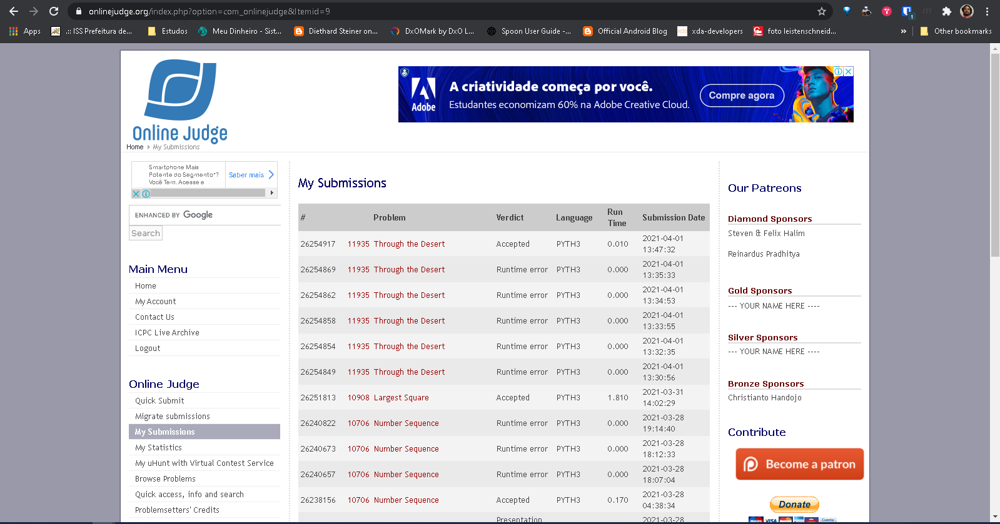

# Análise e Complexidade de Algoritmos

**Rodrigo Seidel**

**PPComp — Campus Serra, Ifes**

**2021-03**

## Breve explicação de como a técnica indicada foi utilizada
Após a realização do tratamento da entrada dos dados, aproveitando-se da padronização existente para compor a lista de eventos, é feito a leitura de cada caso de teste, que tem início no km 0 e seu final no evento Goal.

Para cada caso de teste são inicializadas as variáveis de controle e de acordo com os eventos e suas características, elas vão sendo atualizadas, sendo o consumo em litros calculado a cada evento.

Ao se chegar no evento final, Goal, o consumo em litros é apresentado.

Não consegui encaixar neste problema a técnica de Dividir e Conquistar, sendo o input, após finalizado, processado para se chegar ao resultado a ser apresentado.

Foi recebido "Accepted" no Online Judge, conforme imagem a seguir (primeiro item da lista):

## Análise da complexidade de tempo do programa desenvolvido

- Número de testes: T
- Número de Eventos: E

Foram desconsiderados custos irrelevantes, como atribuição de variáveis, append em listas, etc, pois têm custo 1 (https://wiki.python.org/moin/TimeComplexity).

Considerando as entradas e seu processamento até a pesquisa da coordenadas (e os loopings pelos quais se passa), chegamos à fórmula C = (T-1)*(E-1).

\begin{equation}
C(n) =
  \begin{cases}
    1 & \text{se}~n = 1 \\
    (T-1)*(E-1) & \text{caso contrário}
  \end{cases}
\end{equation}

Avaliando a análise do Wolfram Alpha, chega-se a complexidade O(n).

## Outras informações que o autor julgar apropriadas para o entendimento do trabalho realizado
